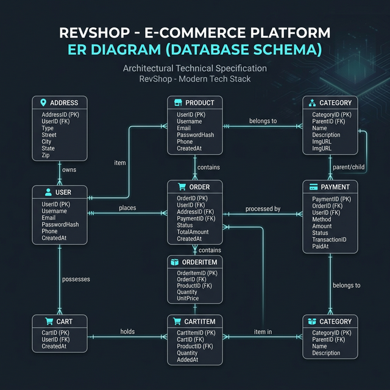
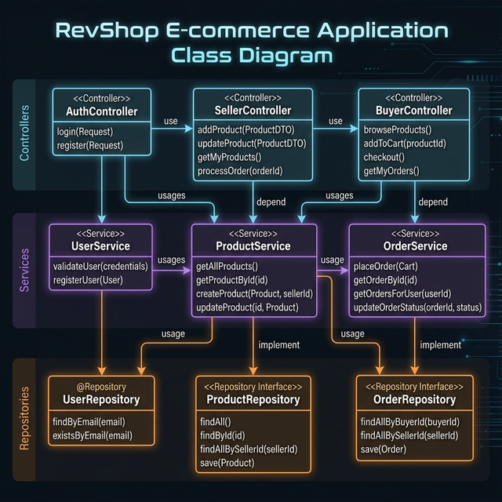
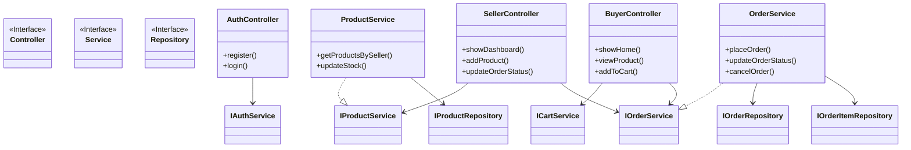

# RevShop P2 - Project Documentation

## 1. Abstract
RevShop P2 is a comprehensive multi-seller e-commerce platform designed to bridge the gap between buyers and sellers. Built using the robust Spring Boot framework, the application provides a seamless shopping experience for buyers while offering a powerful dashboard for sellers to manage their inventory, track sales, and process orders. The system prioritizes security with JWT-based authentication and a modular architecture for scalability.

---

## 2. Project Overview
The RevShop platform is a full-stack e-commerce solution that handles the entire lifecycle of online commerce:
- **For Buyers**: Browse products by category, manage a dynamic shopping cart, save favorites, place orders with multiple payment methods, and track order history with real-time notifications.
- **For Sellers**: Onboard as a specialized user, manage a personal inventory with physical image uploads, view sales analytics on a dedicated dashboard, and manage order statuses for their products.
- **For Admins**: System-wide oversight (extensible).

---

## 3. Tech Stack
- **Backend**: Java 17, Spring Boot 3.x
- **Security**: Spring Security, JSON Web Token (JWT)
- **Data Access**: Spring Data JPA, Hibernate
- **Database**: Oracle SQL (Oracle Database 19c/21c)
- **Template Engine**: Thymeleaf
- **Frontend**: HTML5, CSS3, JavaScript (Vanilla), Bootstrap
- **Build Tool**: Maven
- **Utilities**: Lombok, Slf4j (Logging)

---

## 4. Database Design (ER Diagram)
The database is designed to handle complex relationships between users, products, orders, and payments.



```mermaid
erDiagram
    USER ||--o{ ADDRESS : has
    USER ||--o{ PRODUCT : owns
    USER ||--o{ ORDER : places
    USER ||--o{ FAVORITE : likes
    USER ||--o{ REVIEW : writes
    USER ||--o{ NOTIFICATION : receives
    USER ||--o| CART : possesses
    
    PRODUCT ||--o{ CART_ITEM : in
    PRODUCT ||--o{ ORDER_ITEM : in
    PRODUCT ||--o{ FAVORITE : in
    PRODUCT ||--o{ REVIEW : for
    
    CART ||--o{ CART_ITEM : contains
    
    ORDER ||--o{ ORDER_ITEM : comprises
    ORDER ||--o| PAYMENT : has
    
    ADDRESS ||--o{ ORDER : "shipping/billing"

    USER {
        Long id PK
        String name
        String email UK
        String password
        String phone
        Enum role
        LocalDateTime createdAt
    }

    PRODUCT {
        Long id PK
        String name
        String description
        BigDecimal price
        BigDecimal discountedPrice
        Integer quantity
        String imageUrl
        Enum category
        Long seller_id FK
    }

    ORDER {
        Long id PK
        Long user_id FK
        BigDecimal totalAmount
        Long shipping_address_id FK
        Long billing_address_id FK
        LocalDateTime createdAt
    }

    ORDER_ITEM {
        Long id PK
        Long order_id FK
        Long product_id FK
        Integer quantity
        BigDecimal price
        Enum status
    }

    CART {
        Long id PK
        Long user_id FK UK
    }

    CART_ITEM {
        Long id PK
        Long cart_id FK
        Long product_id FK
        Integer quantity
    }

    PAYMENT {
        Long id PK
        Long order_id FK UK
        BigDecimal amount
        Enum paymentMethod
        Enum status
        String transactionId
    }

    ADDRESS {
        Long id PK
        Long user_id FK
        String street
        String city
        String state
        String zipCode
        String country
    }
```

---

## 5. Normalized Database Schema
The database follows structural normalization principles to ensure data integrity and minimize redundancy.

### First Normal Form (1NF)
- Each table has a unique Primary Key (e.g., `id`).
- All attributes contain atomic values (e.g., `Address` fields like `street`, `city`, `zipCode` are separated).
- There are no repeating groups.

### Second Normal Form (2NF)
- Meets 1NF requirements.
- All non-key attributes are fully functional dependent on the primary key. In tables like `OrderItem`, the `price` is stored at the time of purchase to ensure historical accuracy, preventing partial dependency on the current `Product` price.

### Third Normal Form (3NF)
- Meets 2NF requirements.
- No transitive dependencies exist. For example, `Order` references `Address` via `shipping_address_id` rather than storing address details directly, ensuring that changes to a user's address don't require updates to all past orders.

---

## 6. Class Diagram
The application follows a standard N-tier architecture.





---

## 7. System Architecture

### Control Layer
Responsibilities:
- Handles incoming HTTP requests and maps them to appropriate Service methods.
- Manages Session/Cookie data (e.g., storing the `User` object after login).
- Returns the correct View (Thymeleaf templates) or JSON responses for API calls.
- Performs basic input validation and triggers error pages.

### Service Layer
Responsibilities:
- Contains the core Business Logic.
- Handles **Transactions** (`@Transactional`) to ensure atomic operations (e.g., order creation + stock reduction).
- Coordinates between multiple Repositories and external services (like `NotificationService`).
- Throws custom exceptions (`ResourceNotFoundException`, `InsufficientStockException`) for the Controller layer to catch.

### Repository Layer
Responsibilities:
- Abstraction over the database using Spring Data JPA.
- Handles CRUD operations.
- Utilizes Query Methods (e.g., `findByUserOrderByCreatedAtDesc`) for custom data retrieval.

---

## 8. Workflows

### Order Processing Workflow (Buyer)
1.  **Selection**: Buyer browses products and adds them to the `Cart`.
2.  **Checkout**: Buyer initiates checkout, selecting or adding a `shipping` and `billing` address.
3.  **Payment**: Buyer selects a Payment Method (COD or Mock Online Payment).
4.  **Validation**: `OrderService` validates stock availability for all items in the cart.
5.  **Persistence**:
    *   An `Order` record is created.
    *   `OrderItem` records are created for each product.
    *   Stock levels are decremented in the `Product` table.
    *   A `Payment` record is generated.
6.  **Cleanup**: The user's `Cart` is cleared.
7.  **Notification**: Buyer receives a confirmation notification.

### Seller Workflow
1.  **Onboarding**: User registers with the `SELLER` role.
2.  **Inventory Management**:
    *   Seller uploads products with images (stored locally in `uploads/` directory).
    *   Seller can update price, description, and stock levels.
3.  **Order Oversight**: 
    *   Seller views a list of `OrderItem` entries specific to their products.
    *   Seller updates status (e.g., `PENDING` -> `SHIPPED` -> `DELIVERED`).
4.  **Analytics**: Dashboard provides real-time counts of total products, low-stock alerts, total revenue, and recent orders.

---

## 9. Key Features
- **Security Check**: Unauthorized users are redirected to login for protected routes.
- **Stock Management**: Prevents orders if quantities are insufficient.
- **Dynamic Cart**: Real-time totals and item management.
- **Notifications**: In-app alerts for both buyers and sellers on order status changes.
- **Image Uploads**: Multi-part file support for product images.
- **Reviews & Ratings**: Buyers can provide feedback on purchased products.

---

## 10. Future Enhancements
- **Advanced Analytics**: Graphical representation of sales trends using Chart.js.
- **AI Recommendations**: Personalized product suggestions based on browsing history.
- **Real Payment Gateway**: Integration with Stripe or Razorpay for actual transactions.
- **Global Search**: Full-text search with filters (ElasticSearch).
- **Mobile App**: Dedicated mobile interface using React Native or Flutter.

---

## 11. Conclusion
RevShop P2 is a robust, scalable e-commerce solution that leverages the best practices of modern Java development. Its decoupled architecture, secure authentication flow, and intuitive seller/buyer workflows make it a reliable platform for retail operations. The system is designed with future growth in mind, allowing for easy integration of new features and specialized services.
